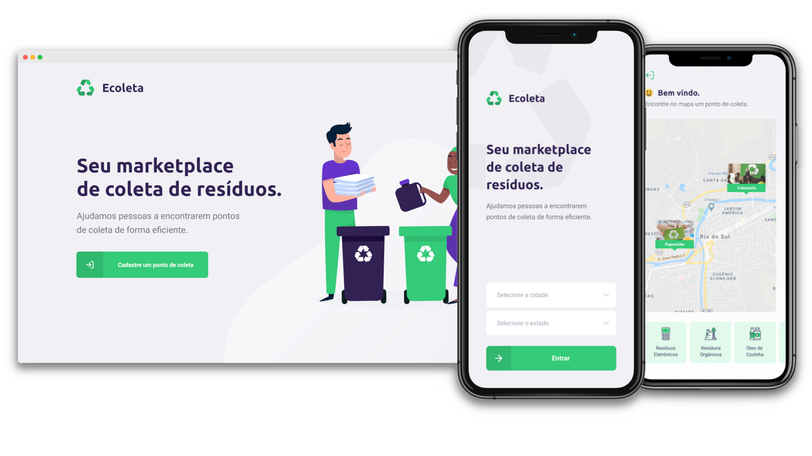

## Next Level Week #01

## :information_source: O que é Next Level Week?

NLW é uma semana prática com muito código, desafios, networking e um único objetivo: levá-lo ao próximo nível.
Através do nosso método você aprenderá novas ferramentas, aprenderá sobre novas tecnologias e descobrirá hacks que irão impulsionar sua carreira.
Um evento online totalmente gratuito que o ajudará a dar o próximo passo em sua evolução como desenvolvedor.

### Dias
- Dia 1: Acelerando sua evolução 01/06 - :heavy_check_mark:
- Dia 2: Olhando para as oportunidades 02/06 - :heavy_check_mark:
- Dia 3: A escolha da Stack 03/06 - :heavy_check_mark:
- Dia 4: Até 2 anos em 2 meses 04/06 - :heavy_check_mark:
- Dia 5: Milha extra 05/06 - :heavy_check_mark:

## 💻 Project

Ecoleta é um projeto desenvolvido com base na semana internacional do meio ambiente.
O objetivo é conectar pessoas a empresas que coletam resíduos específicos como lâmpadas, pilhas, óleo de cozinha, etc.

<h1 align="center">
    
</h1>

## :rocket: Tecnologias

Este projeto foi desenvolvido com as seguintes tecnologias:

- [Node.js][nodejs]
- [TypeScript][typescript]
- [React][reactjs]
- [React Native][rn]
- [Expo][expo]
